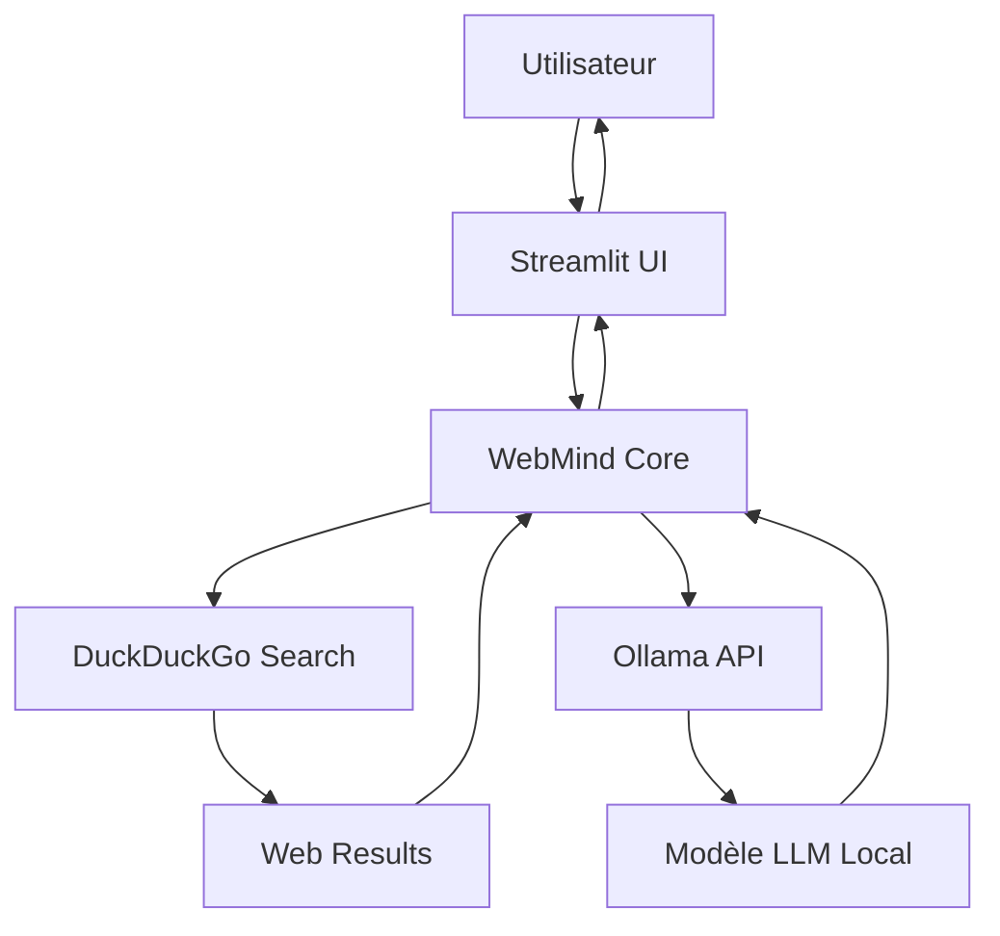

# WebMind - Chatbot Intelligent avec Accès Web

<div align="center">


\*\*Une application de chatbot révolL'application sera disponible à l'adresse : `http://localhost:8501`

---

## Utilisation

### Interface Utilisateurire**WebMind - Réalisé avec passion par YASSINE KAMOUSSI**

*Révolutionnons ensemble l'accès à l'information !*mbinant l'intelligence artificielle locale avec l'accès web en temps réel\*\*

[](https://python.org)
[](https://streamlit.io)
[](https://ollama.com)

**Réalisé par : YASSINE KAMOUSSI**

</div>

---

## Table des Matières

- [Aperçu](#aperçu)
- [Fonctionnalités](#fonctionnalités)
- [Architecture](#architecture)
- [Installation](#installation)
- [Utilisation](#utilisation)
- [Configuration](#configuration)
- [Performance](#performance)
- [Contribution](#contribution)

---

## Aperçu

**WebMind** est une application de chatbot de nouvelle génération qui révolutionne l'interaction avec l'intelligence artificielle en combinant :

- **Intelligence Locale** : Utilise des modèles de langage open-source via Ollama
- **Accès Web Temps Réel** : Recherche automatique d'informations actualisées
- **Confidentialité Totale** : Toutes les opérations sont effectuées localement
- **Streaming Avancé** : Réponses affichées en temps réel

### Cas d'Usage

- **Actualités et Événements** : Obtenez des informations à jour sur l'actualité mondiale
- **Recherche Académique** : Accédez à des données récentes pour vos recherches
- **Veille Technologique** : Restez informé des dernières innovations
- **Support Décisionnel** : Analyses basées sur des données actuelles

---

## Fonctionnalités

### Fonctionnalités Principales

| Fonctionnalité                           | Description                                    | Avantage                       |
| ---------------------------------------- | ---------------------------------------------- | ------------------------------ |
| **Interface Chat Moderne**               | Interface utilisateur intuitive avec Streamlit | Expérience utilisateur fluide  |
| **RAG (Retrieval-Augmented Generation)** | Recherche web + génération IA                  | Réponses précises et actuelles |
| **Streaming en Temps Réel**              | Affichage progressif des réponses              | Interaction naturelle          |
| **Multi-Modèles**                        | Support de tous les modèles Ollama             | Flexibilité maximale           |
| **Historique de Conversation**           | Mémoire contextuelle des échanges              | Conversations cohérentes       |

### Sécurité et Confidentialité

- **Traitement Local** : Aucune donnée envoyée vers des serveurs externes
- **Open Source** : Code transparent et vérifiable
- **Contrôle Total** : Vous maîtrisez vos données
- **Conformité RGPD** : Respect de la vie privée

---

## Architecture

### Stack Technologique



### Composants

- **Frontend** : [Streamlit](https://streamlit.io/) - Interface web réactive
- **Backend IA** : [Ollama](https://ollama.com/) - Gestion des modèles locaux
- **Moteur de Recherche** : [DuckDuckGo Search](https://pypi.org/project/duckduckgo-search/) - Recherche web privée
- **Langage** : Python 3.9+ - Performance et simplicité

---

## Installation

### Prérequis Système

- **Système d'Exploitation** : Windows 10/11, macOS 10.15+, Ubuntu 18.04+
- **Python** : Version 3.9 ou supérieure
- **Mémoire RAM** : 8 GB minimum (16 GB recommandé)
- **Espace Disque** : 10 GB libres (pour les modèles)

### Installation d'Ollama

Téléchargez et installez Ollama depuis le [site officiel](https://ollama.com/).

```bash
# Vérifiez l'installation
ollama --version

# Téléchargez un modèle (exemple avec Gemma)
ollama pull gemma2
```

### Installation du Projet

```bash
# Clonez le projet
git clone https://github.com/yassinekamouss/WebMind.git
cd webmind

# Créez un environnement virtuel
python -m venv venv

# Activez l'environnement virtuel
# Windows:
venv\Scripts\activate
# macOS/Linux:
source venv/bin/activate

# Installez les dépendances
pip install -r requirements.txt
```

### Lancement de l'Application

```bash
# Démarrez Ollama (si pas déjà fait)
ollama serve

# Lancez WebMind
streamlit run main.py
```

L'application sera disponible à l'adresse : `http://localhost:8501`

---

## � Utilisation

### Interface Utilisateur

1. **Zone de Chat** : Saisissez vos questions dans la barre de chat
2. **Recherche Automatique** : L'IA recherche automatiquement des informations pertinentes
3. **Réponse Contextualisée** : Obtenez une réponse basée sur les données web récentes
4. **Historique** : Consultez l'historique de vos conversations

### Exemples de Questions

```
"Quelles sont les dernières nouvelles sur le changement climatique ?"
"Quelles sont les tendances technologiques de 2025 ?"
"Comment évoluent les marchés financiers aujourd'hui ?"
"Quelles sont les dernières découvertes en intelligence artificielle ?"
```

---

## Configuration

### Changement de Modèle

Modifiez la constante `OLLAMA_MODEL` dans `main.py` :

```python
# Modèles recommandés
OLLAMA_MODEL = 'llama3'      # Polyvalent et rapide
OLLAMA_MODEL = 'gemma2'      # Excellent pour le français
OLLAMA_MODEL = 'mistral'     # Optimisé pour le code
OLLAMA_MODEL = 'phi3'        # Léger et efficace
```

### Personnalisation de la Recherche

Ajustez les paramètres de recherche dans la fonction `search_the_web()` :

```python
# Nombre de résultats (1-10)
results = list(ddgs.text(query, max_results=4))

# Région de recherche (facultatif)
results = list(ddgs.text(query, region='fr-fr'))
```

### Variables d'Environnement

Créez un fichier `.env` pour personnaliser l'application :

```env
OLLAMA_MODEL=gemma2
MAX_SEARCH_RESULTS=4
APP_TITLE=WebMind - Mon Assistant IA
```

---

## Performance

### Benchmarks

| Modèle  | Taille | RAM Requise | Vitesse | Qualité |
| ------- | ------ | ----------- | ------- | ------- |
| Phi3    | 2.2GB  | 4GB         | Élevée  | Moyenne |
| Gemma2  | 5.5GB  | 8GB         | Bonne   | Bonne   |
| Llama3  | 8.0GB  | 12GB        | Moyenne | Élevée  |
| Mistral | 7.2GB  | 10GB        | Bonne   | Bonne   |

### Optimisations

- **GPU** : Utilisez CUDA/ROCm pour des performances 10x supérieures
- **Quantification** : Modèles Q4 pour réduire l'usage mémoire
- **Cache** : Mise en cache automatique des résultats de recherche

---

## Contribution

Nous accueillons toutes les contributions ! Voici comment participer :

### Signaler un Bug

1. Vérifiez que le bug n'a pas déjà été signalé
2. Créez une issue détaillée avec :
   - Description du problème
   - Étapes de reproduction
   - Environnement (OS, Python, versions)
   - Logs d'erreur

### Proposer une Fonctionnalité

1. Créez une issue avec le label "enhancement"
2. Décrivez clairement la fonctionnalité souhaitée
3. Expliquez l'intérêt et les cas d'usage

### Contribuer au Code

1. Fork le projet
2. Créez une branche feature (`git checkout -b feature/nouvelle-fonctionnalite`)
3. Committez vos changements (`git commit -m 'Ajout nouvelle fonctionnalité'`)
4. Pushez la branche (`git push origin feature/nouvelle-fonctionnalite`)
5. Ouvrez une Pull Request

---

<div align="center">

**WebMind - Réalisé avec ❤️ par YASSINE KAMOUSSI**

</div>

---
